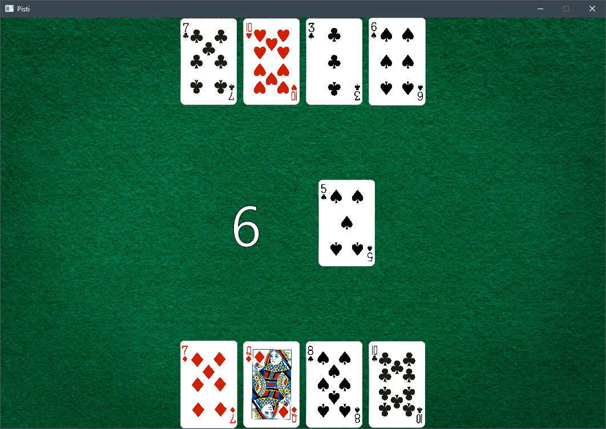

## Pişti

*  Also known as [Bastra](https://en.wikipedia.org/wiki/Bastra), Pişti is a [Turkish](https://en.wikipedia.org/wiki/Turkey) card game that uses a standard 52—card deck
*  Cards are played to a central pile which can be captured by playing a card that matches the previous card or a [jack](https://en.wikipedia.org/wiki/Jack_(playing_card))

